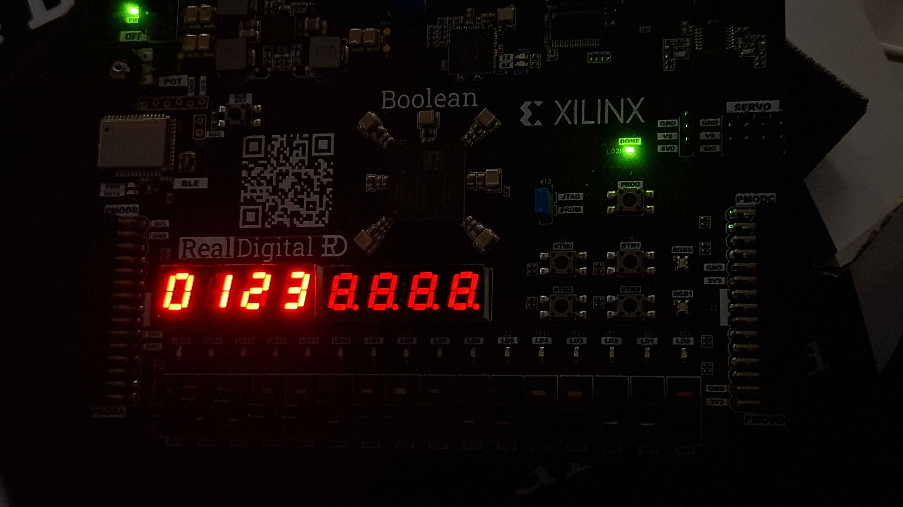
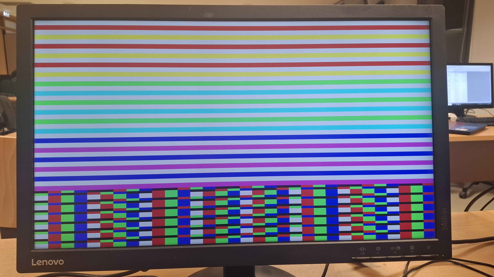
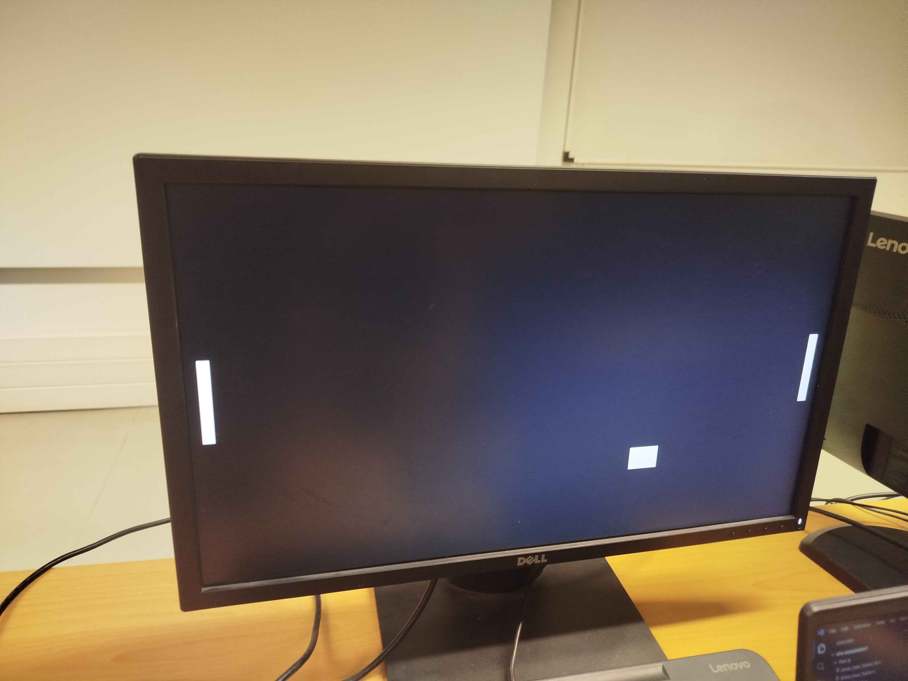

# FPGA & Digital Systems Design

A comprehensive collection of hardware projects from ECE340-Digital Systems Lab developed using **Verilog**, focusing on digital logic design, communication protocols, and real-time video processing.

---

## 📑 Table of Contents

<table align="center">
<tr valign="top">
<td>
 
**📚 Course Overview**
- [Project Overview](#-project-overview)
- [Laboratory Assignments](#-laboratory-assignments)
- [Hardware Implementation Photos](#-hardware-implementation-photos)
- [Bonus Features & Integration (Labs 2-4)](#-bonus-features--integration-labs-2-4)

</td>
<td>

**🔌 Hardware Projects**
- [1. 7-Segment Display](#-1-7-segment-display-controller)
- [2. UART Communication Protocol](#-2-uart-communication-protocol)
- [3. HDMI Controller](#-3-hdmi-controller)
- [4. Hardware-Based Pong Game](#-4-hardware-based-pong-game)

</td>
<td>

**🛠️ Setup & Environment**
- [Development Tools](#️-development-tools)
- [How to Run](#️-how-to-run)
- [Documentation](#-documentation)

</td>
</tr>
</table>

---

## 📖 Project Overview

This repository documents my journey through digital systems design, starting from basic IO control to complex real-time graphics engines implemented on **Xilinx Spartan-7 FPGA (XC7S50)**.

**Each project folder contains a complete package that includes:**
* **Source Code:** All Verilog and XDC constraint files.
* **Assignment Specs:** The official laboratory requirements and guidelines.
* **My Reports:** Detailed documentation analyzing the design logic, FSM structures, extensive waveform analysis, and photos from the hardware implementation.

---

## 📂 Laboratory Assignments

### 🔢 1. 7-Segment Display Controller
**Objective:** Designing a modular controller to drive an 7-segment display using time-multiplexing.
* **Features:** Clock dividers for refresh rates, Debouncer module and BCD-to-7Segment decoders.
* `📂 Directory:` [/Seven_Segment_Display](./Seven_Segment_Display)

### 📡 2. UART Communication Protocol
**Objective:** Implementation of a Universal Asynchronous Receiver-Transmitter (UART) from scratch.
* **Features:** Custom Baud Rate Generator, Start/Stop bit synchronization, and FIFO buffering.
* `📂 Directory:` [/UART_Protocol](./UART_Protocol)

### 📺 3. HDMI controller
**Objective:** Generating high-definition video signals using precise timing controllers.
* **Features:** H-Sync/V-Sync generation, Pixel Clock management, and RGB patterns.
* `📂 Directory:` [/HDMI_Controller](./HDMI_Controller)

### 🎮 4. Hardware-Based Pong Game
**Objective:** A fully functional, real-time video game implemented entirely in hardware logic.
* **Logic:** Sprite generation, collision detection, and scoring system.
* **Rendering:** On-the-fly pixel generation for dual-player control.
* `📂 Directory:` [/Pong_Game](./Pong_Game)

---

## 📸 Hardware Implementation Photos

Real-time execution on the Boolean Board (Spartan-7 FPGA). Detailed simulation waveforms and architectural analysis can be found in the PDF reports.

<table align="center">
  <tr>
    <td align="center"><b>7-Segment Driver (Lab 1)</b></td>
    <td align="center"><b>HDMI Graphics (Lab 3)</b></td>
    <td align="center"><b>Hardware Pong (Lab 4)</b></td>
  </tr>
  <tr>
    <td></td>
    <td></td>
    <td></td>
  </tr>
</table>

---

### ✨ Bonus Features & Integration (Labs 2-4)

I have extended the basic requirements for the majority of the assignments, for example in Lab4:

* **Lab 4 (Final Integration - The Pong Game):** This project serves as a "Full System Integration" where I combined elements from all previous labs:
    * **Advanced Gameplay:** Implemented multiplayer 1v1 mode, dynamic puck speed scaling.
    * **Score System:** Integrated the **7-segment driver (from Lab 1)** to display real-time player scores on the FPGA's LEDs.
    * **Memory Graphics:** Utilized **VRAM buffers (from Lab 3)** to store and render custom "Winner" and "Game Over" screens.

## 🛠️ Development Tools

| Category | Tools |
| :--- | :--- |
| **Languages** | `Verilog` |
| **Software** | `Xilinx Vivado`, |
| **Hardware** | `Xilinx Spartan-7 FPGA (XC7S50)` |

--- 

## ⚙️ How to Run

1. **Open Vivado** and import the source files.
2. **Generate Bitstream** and program your FPGA.

---

## 📝 Documentation

Unfortunately due to the large size of auto-generated Vivado files, I have only included the source code (.v), the constraints (.xdc), and the PDF reports to keep the repository clean.
